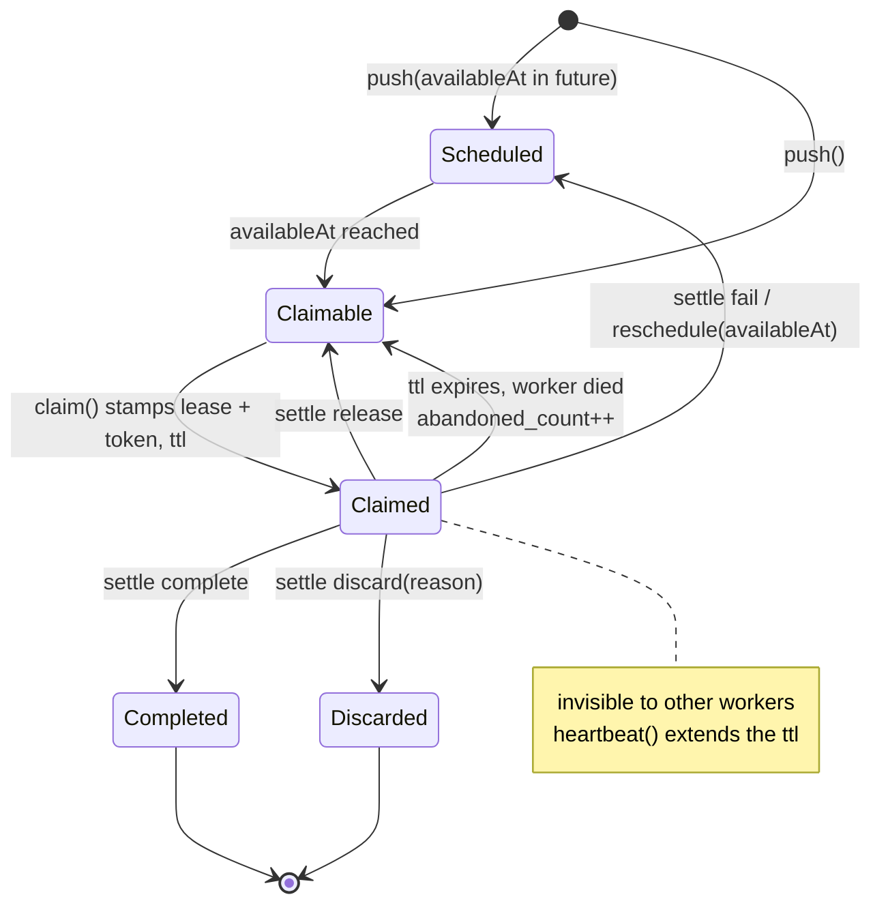
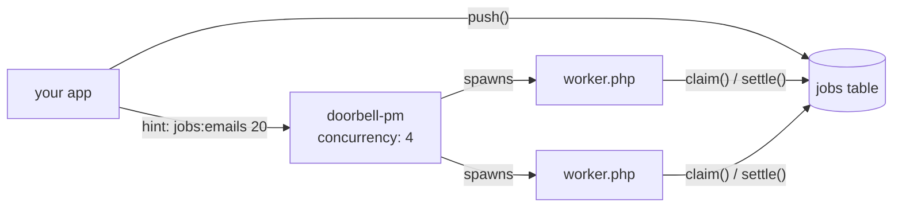

# lezhnev74/jobs_storage

[](https://github.com/lezhnev74/jobs_storage/actions/workflows/qa.yml)

Persistent job storage for PHP on the database you already run. Producers push jobs, workers claim batches under a
time-bounded lease, work on them, and settle each outcome explicitly. PostgreSQL and MySQL drivers included.

It is a **job store, not a broker**: jobs are rows with identity, history and telemetry - queryable, countable,
requeuable. There is no daemon, no broker process, no framework binding.

```bash
composer require lezhnev74/jobs_storage
```

PHP 8.2+, and PostgreSQL 14+ (`ext-pdo_pgsql`) or MySQL 8+ (`ext-pdo_mysql`).

## 60 seconds

```php
use Lezhnev74\Jobs\Driver\Postgres\PostgresDriver;
use Lezhnev74\Jobs\Model\{NewJob, Settlement, Ttl, WorkerId};
use Lezhnev74\Jobs\Query\ClaimQuery;
use Lezhnev74\Jobs\Model\PoolName;

$driver  = new PostgresDriver(new PDO($dsn, $user, $pass));
$queue   = $driver->queue();     // JobQueue: push + claim + settle
$monitor = $driver->monitor();   // JobMonitor: read + count + requeue + delete

// --- producer -------------------------------------------------------------
$queue->push(
    NewJob::make('billing.invoice.send', 'emails', ['invoice' => 42]),
    NewJob::make('billing.invoice.send', 'emails', ['invoice' => 43]),
);

// --- worker ---------------------------------------------------------------
$claimed = $queue->claim(
    ClaimQuery::pool(new PoolName('emails'))->limit(20),   // batch size
    new WorkerId('emails-worker-1'),
    Ttl::minutes(5),                                       // lease TTL
);

$acks = [];
foreach ($claimed->jobs as $job) {
    try {
        send($job->payload['invoice']);
        $acks[] = Settlement::complete($job);
    } catch (Throwable $e) {
        $acks[] = Settlement::fail($job, new Reason(['error' => $e->getMessage()]), CarbonImmutable::now()->addMinutes(5));
    }
}

$queue->settle($claimed->token, ...$acks);
```

The schema is never applied at runtime - apply `resources/schema/postgres/*` (or `mysql/*`) yourself.

## Leases, in one picture

A claim does not remove the job; it stamps a lease on the row for `$ttl`. Nobody else can see the job while the
lease is live. Settling ends it.



Rules that follow from this:

- **No reaper process.** An expired lease is simply claimable again; the next `claim()` reclaims it.
- **Fencing is by token, not by clock.** `claim()` mints one `LeaseToken` for the whole batch. A late ack after the
  TTL still lands - unless someone re-claimed the job meanwhile, which changed the token. Then the ack is reported
  **stale** and does nothing. Staleness never throws.
- **Long jobs extend the lease** with `heartbeat($token, Ttl::minutes(5), ...$ids)` instead of taking a long TTL.
- **Settle is a batch**, and per-id: the report tells you what landed.

```php
$report = $queue->settle($claimed->token, ...$acks);

$lost = $claimed->stale($report);      // another worker owns these now - drop them, never retry
$todo = $claimed->unsettled($report);  // never reported (e.g. worker ran out of time) - carry to the next round
```

Five outcomes, all under the same token: `complete`, `discard` (terminal, with a reason), `fail` (retry at a time
you pick, bumps the failure streak), `reschedule` (same, but "not an error"), `release` (drop the lease, no counters
touched).

## Pools, names and prefix search

Two orthogonal axes, both plain strings:

- **Pool** - *who* works on it. A worker claims from exactly one pool. Pools are how you separate capacity:
  `emails`, `video`, `reports`. Pool is also the dedup scope.
- **Name** - *what* the job is, dot-segmented: `billing.invoice.send`, `billing.invoice.void`, `media.transcode`.

A claim may narrow by name prefix, so one pool can serve a whole family of work, and a dedicated worker can take a
slice of it:

```php
ClaimQuery::pool(new PoolName('billing'));                          // everything in the pool
ClaimQuery::pool(new PoolName('billing'))->namePrefix('billing.invoice.');  // only invoice jobs
ClaimQuery::pool(new PoolName('billing'))->payload('$.region', 'eu');       // and only EU ones
```

Prefix matching is a literal string prefix on the stored name, so `billing.invoice.` matches `billing.invoice.send`
and `billing.invoice.void`. The same filters carry over to the read side via `JobQuery::from($claimQuery)`, with
`states()`, `availableBefore()`, `limit()`, `after()` (keyset paging) and `orderBy()` on top.

## Pushing your own types

Any object can describe itself as a job - your classes stay yours and never extend a library class:

```php
final readonly class SendInvoice implements DescribesJob
{
    public function __construct(private int $invoiceId, private JobId $id) {}

    public function toJob(): NewJob
    {
        return new NewJob(
            id: $this->id,                                  // stable per instance: push stays idempotent
            name: new JobName('billing.invoice.send'),      // explicit, never derived from the class name
            pool: new PoolName('emails'),
            payload: ['invoice' => $this->invoiceId],
        );
    }
}

$queue->push(new SendInvoice(42, JobId::new()), $someNewJob);  // both shapes, one batch
```

`toJob()` is called once per push and must be cheap, side-effect free and deterministic. There is no reverse
direction: the library hands back a `Job` with a `payload` array and stops there - payload versioning and a
name-to-class map are application decisions.

## Deduplication

`push` is idempotent on two independent identities and never throws on either:

- **`JobId`** - re-pushing an existing id is a no-op forever, so a lost reply is safe to retry.
- **dedup key** - within one pool, only one *non-terminal* row may hold a given key. A colliding push is dropped,
  never merged; once that row completes or is discarded, the key is free and the same work inserts as a fresh row.
  This is what makes a producer that re-derives the same job on every tick safe.

Every `NewJob` carries a key - there is no "no dedup" mode. It defaults to a `sha256` over `[pool, name, payload]`
(`availableAt` is excluded: "the same work, maybe sooner" must still deduplicate), or set your own:
`$job->dedup('invoice:2026-09:acme')`.

```php
$report = $queue->push($a, $b);
$report->isClean();                // nothing was dropped
$report->wasDeduplicated($b->id);  // this one was not stored

$holder = $monitor->find(new PoolName('emails'), DedupKey::fromString('invoice:2026-09:acme'));
$holder?->state();                 // scheduled / claimable / claimed - or null if the key is free
```

`find` sees non-terminal rows only; read the history of every run of a key with
`$monitor->read($query->dedupKeys($key))`. Details: [`dev_docs/dedup.md`](dev_docs/dedup.md).

## Monitoring and ops

`JobReader` (observe) and `JobJanitor` (destroy/rescue) are separate interfaces, so a dashboard can be handed the
read half alone:

```php
$monitor->get($id);
$monitor->count($query->states(State::Claimable));
$monitor->aggregate($query, GroupBy::State);           // [['group' => 'claimable', 'count' => 12], ...]

$monitor->requeue($query->states(State::Discarded), CarbonImmutable::now(), new Reason(['op' => 'bug-fixed']));
$monitor->delete($query->states(State::Completed)->limit(1000));  // skips live-leased rows
```

State is never stored - it is inferred in SQL on the database clock, so `JobQuery::states()` is authoritative while
`Job::state()` on a fetched snapshot is display only. Every janitor verb honors `limit()` and returns the number of
rows it touched, so ops sweeps run in batches and never block a claim.

## Running workers (orchestration)

This library stores jobs; it does not start processes. A worker is a plain PHP script that claims, works, settles
and exits. You need something to run copies of it.

Any of these works: a systemd unit or supervisor running N long-lived loops, a cron job, a Kubernetes Deployment.
For on-demand scaling, [**doorbell-pm**](https://github.com/lezhnev74/doorbell-pm) pairs particularly well: it is a
small process spawner that listens for "there is work" hints and starts up to N copies of the command configured
for that pool. Its pools map one-to-one onto pools here.



```yaml
# doorbell.yaml
pools:
  emails:
    command: [ php, worker.php, --pool=emails ]
    concurrency: 4
    poke: 1m      # self-hint: safety net for lost hints and leftover backlog
```

The producer hints after pushing (`POST /hint` with `{"jobs:emails": 20}`, or a Redis `PUBLISH`), doorbell spawns
workers, each claims its own batch here and exits when the pool runs dry. The hint is approximate - an over-spawned
worker finds nothing and exits, an under-spawned pool is covered by `poke`. Nothing in this library depends on it;
the store is the only shared state.

## Drivers

`PostgresDriver` and `MysqlDriver` ship in the box; both implement the same public contracts and pass the same
behavioral conformance suite. Postgres runs one autocommit statement per call; MySQL uses short transactions
(no `UPDATE ... RETURNING`) and nests on a `SAVEPOINT` inside a caller's transaction.

A new backend is added by PR: implement `Driver/Contract` and extend
`Lezhnev74\Jobs\Tests\Support\DriverConformanceTestCase` in its integration tests, exactly like the bundled drivers.
Design notes: [`dev_docs/overview.md`](dev_docs/overview.md), [`dev_docs/postgres.md`](dev_docs/postgres.md),
[`dev_docs/mysql.md`](dev_docs/mysql.md).

## Development

Everything runs inside the dev image (`Dockerfile.dev`: PHP 8.5 with `pdo_pgsql`, `pdo_mysql`, `pcntl` and pcov), so
the only host requirement is Docker. CI runs the same gate across 8.2, 8.3, 8.4 and 8.5; to reproduce an older job
locally, rebuild against that version: `./dev build --build-arg PHP_VERSION=8.2`.

```
./dev up                     # start Postgres + MySQL and wait for them
./dev composer install
./dev qa                     # cs + stan + tests with CRAP <= 6
./dev cs / cs:fix            # PSR-12 + PER-CS 2.0 (php-cs-fixer)
./dev stan                   # PHPStan level 7 + strict rules
./dev test                   # unit tests, no I/O
./dev test:pg / test:mysql   # the conformance suite against one backend
./dev test:integration       # both
./dev phpunit <args>         # anything else
```

Each maps to the matching `composer` script, so `composer qa` and friends work directly if your host PHP has the
extensions. `./dev qa` runs the full suite including integration: the CRAP gate is measured over everything, since
drivers are behavioral code that only a real database exercises.

The conformance suite drops and recreates the schema through the driver SPI before every test - point it at a
throwaway database. It is test-only and is not shipped in installs.

## License

MIT - see [LICENSE](LICENSE).
